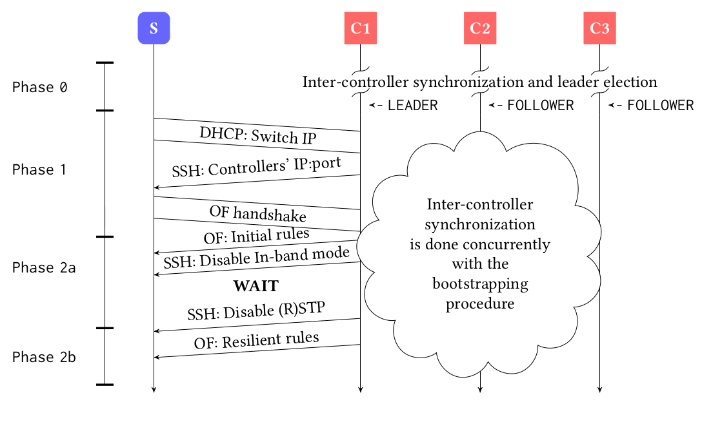
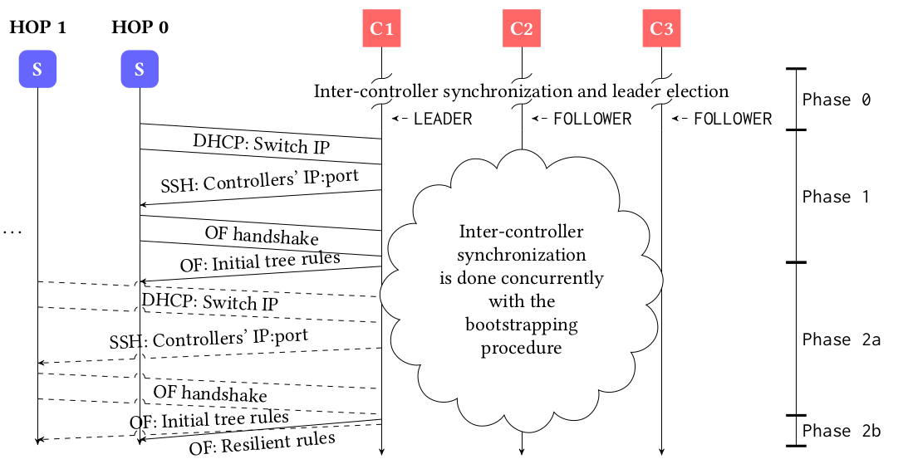
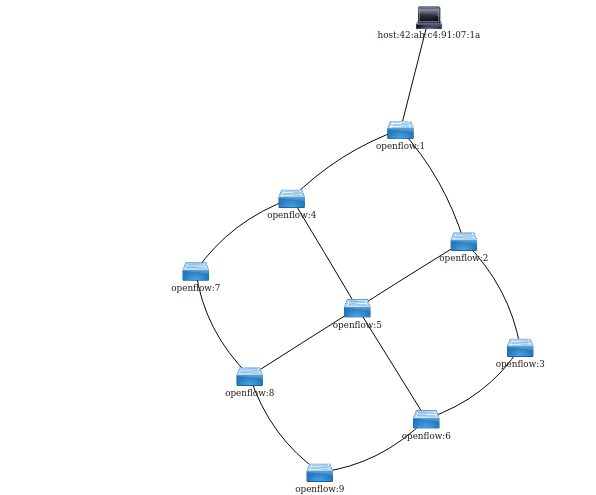
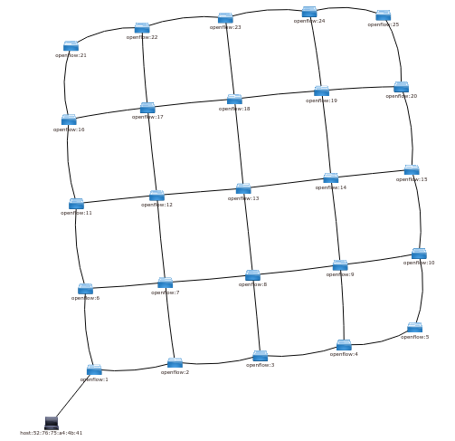
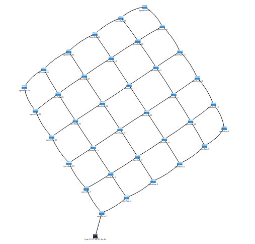

# INITIAL REPOSITORY SETUP IS WORK IN PROGRESS!

# Automated Bootstrapping of In-Band Controlled SDNs

- OpenDaylight-compatible modules and exemplary network emulation for bootstrapping of a multi-controller OpenFlow-based in-band control plane.

- Full details of the designs are provided in our ACM SIGCOMM SOSR 2020 publication titled: "Automated Bootstrapping of A Fault-Resilient In-Band Control Plane".

- By default, the provided configuration realizes the introduced HHC approach (no reliance on RSTP) and it does so in a local environment, i.e., all controller instances and switches are instantiated in separate network namespaces in the local host. In case you want to run network emulation or the controller remotely, or you want to establish a cluster of controllers, adjust the configuration scripts in the ```sdn-demo``` and ```emulated-topology``` directory correspondingly.

---


## Directory Explanations
- *sdn-demo*: Holds the core controller code for building of the ODL distribution.

- *emulated-topology*: Orchestrates the network emulation for easy setup of all topologies described in the paper. 3x3 grid is selected as default. The accompanying config file allows for topology selection, modifications to controller(s) placement, and local / remote emulation. 

- *odl-dependencies*: Contains the modified accompanying modules, used in OpenFlow interactions, host / controller topology discovery etc. The implementation of this differs slightly from same-named off-the-shelf ODL modules (details provided in the paper).

---

## Design

Overview of the two approaches for bootstrapping of in-band control networks:

| HSW (needs RSTP) | HHC (iterative hop-by-hop) |
|------------|-------------|
|  |  |

Details on both designs are presented in the attached ACM SOSR publication.

## Usage

### Build Tools:
- OpenJDK 8
- Docker-CE latest package (each OVS instance is hosted in a separate container interconnected using veth pairs)
- Maven

### Integration tools:
- arping
- openvswitch-switch
- Postman (Google-Chrome App)
- Evaluation / Measurement [optional]: Python3 & PyPlot/Matplotlib

### Build Guide:
- In order to resolve the OpenDaylight artifacts, first edit your ```~/.m2/settings.xml``` as per https://wiki.opendaylight.org/view/GettingStarted:Development_Environment_Setup
- Build the customized openflowplugin, odl-l2switch and openflowjava components using ```build.sh``` in the corresponding sub-directories of ```odl-dependencies```.
- Build the ```emulated-topology``` (ref. contained ```README.md``` for further instructions)
- Copy the ```run_arping.sh``` script to your chosen location and update the path to script correspondingly in ```demo_sdn/configure_arping_local_remote.sh```
- Build the ```demo-sdn``` using the ```build.sh``` script inside (ref. contained ```README.md``` for further information)

### Runtime:
- Run the ```emulate_network.sh``` script in ```emulated-topology```
- In demo-sdn, run one of the ```exec*``` scripts after the 1st script above has finished (the network and controller namespace are necessary for controller instantiation)
- Execute the REST script for startup of DHCP server (POSTMAN attached) - only if enabled in XML files starting with "149"

### Results:

- In ODL's DLUX GUI:

| 3x3 Grid (1C) | 5x5 Grid (1C) | 6x6 Grid (1C) |
|------------|------------|------------|
|  |  |  |


---

## Support

Reach out to us:

- Twitter at <a href="http://twitter.com/TUM_LKN" target="_blank">`@TUM_LKN`</a>

---

## License

[](https://opensource.org/licenses/EPL-1.0)

- **[EPL license](https://opensource.org/licenses/EPL-2.0)**
